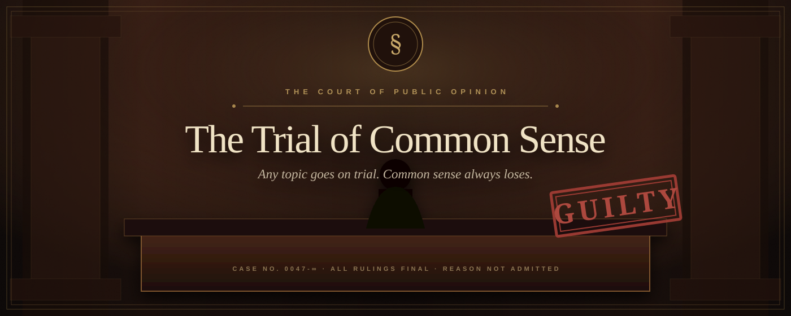
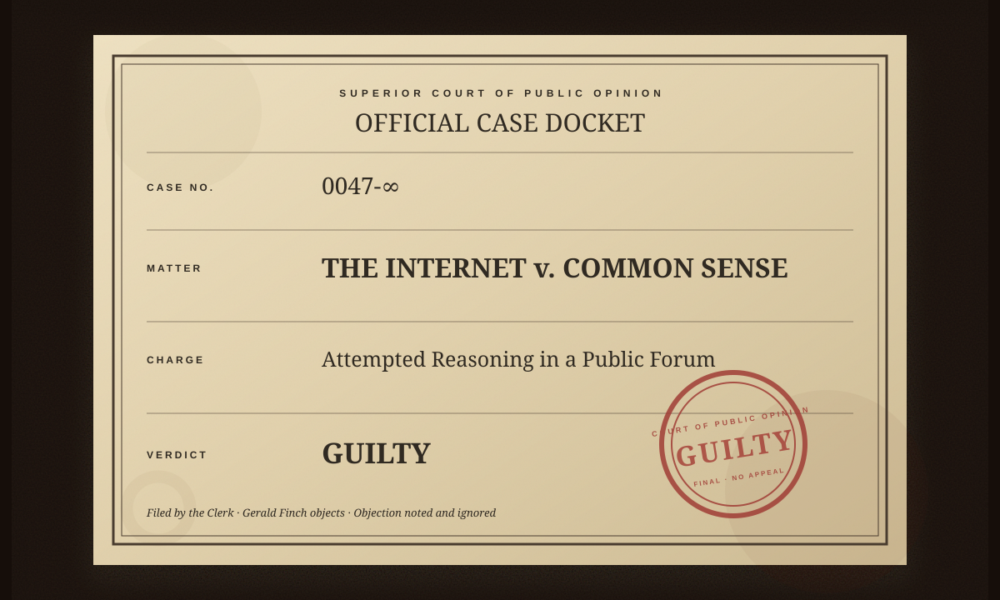
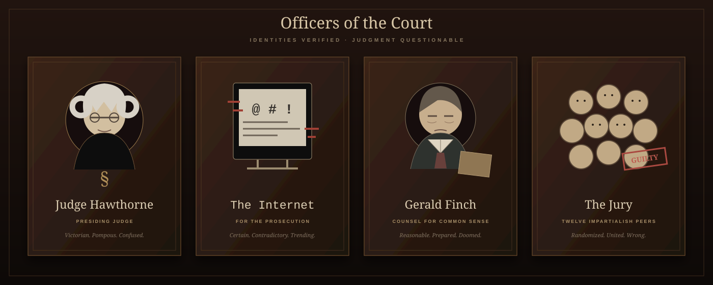
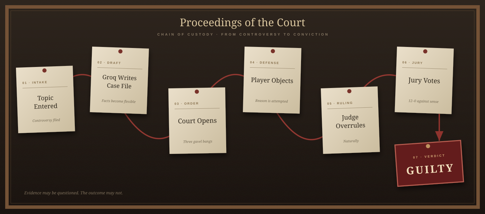

<p align="center">
  
</p>

<p align="center">
  
  
  
  
  
</p>

<p align="center"><em>A cinematic courtroom simulator where you defend Common Sense against The Internet. The court is rigged.</em></p>

<p align="center">
  <a href="#run-locally"></a>
  <a href="https://github.com/khushalx/trial-of-common-sense"></a>
</p>

---

<p align="center">
  
</p>

## The charge

Enter any debatable topic. Groq drafts the proceedings. You serve as Associate Counsel, object with dignity, and watch Judge Hawthorne misunderstand everything.

**The verdict never changes. Common Sense always loses.**

<!--
## Photographic evidence

Add captured application screenshots at:
- public/readme/lobby.png
- public/readme/trial.png
- public/readme/verdict.png

<p align="center">
  
  
  
</p>
-->

## Officers of the court

<p align="center">
  
</p>

## Chain of proceedings

<p align="center">
  
</p>

## Evidence admitted

- Seven-stage theatrical trial with controlled typewriter pacing
- Groq-generated case files with strict local validation and archival fallback
- Associate Counsel choices that affect the record—but never the verdict
- Pinned exhibits, twelve-juror deliberation, case history, and shareable rulings
- Optional local courtroom audio with silent-safe fallback

## Run locally

```bash
npm install
cp .env.example .env.local
# Add GROQ_API_KEY to .env.local
npm run dev
```

Open [http://localhost:3000](http://localhost:3000), file a controversy, and prepare to be overruled.

---

<p align="center"><sub>CASE NO. 0047-∞ · REASON ENTERED INTO EVIDENCE AND PROMPTLY DISMISSED</sub></p>
